# Clickstream Analysis with ksqlDB, Kafka, and Grafana

This project successfully implements the [Confluent Clickstream Analysis](https://docs.confluent.io/platform/current/ksqldb/tutorials/clickstream.html) tutorial using ksqlDB, Kafka, and Grafana.

## Project Overview
This project demonstrates how to analyze clickstream data in real-time using the following components:

- **Kafka** - Data streaming platform for handling clickstream data.
- **ksqlDB** - Used to create streaming tables and process data.
- **Elasticsearch** - For indexing and searching data.
- **Grafana** - For visualizing clickstream data and metrics.

## Features Implemented
Configured Kafka and ksqlDB for streaming data.
Developed ksqlDB queries to build tables such as:
  - `CLICK_USER_SESSIONS`
  - `USER_IP_ACTIVITY`
  - `ENRICHED_ERROR_CODES_COUNT`
  - `ERRORS_PER_MIN_ALERT`
  - `ERRORS_PER_MIN`
  - `EVENTS_PER_MIN`
  - `PAGES_PER_MIN`

Integrated Elasticsearch for data indexing.
Configured Grafana dashboards for data visualization.
Automated data generation and pausing mechanism for simulating user inactivity.

## Setup Instructions
1. **Getting Jar Files**
```bash
docker run -v $PWD/confluent-hub-components:/share/confluent-hub-components confluentinc/ksqldb-server:0.8.0 confluent-hub install --no-prompt confluentinc/kafka-connect-datagen:0.4.0
docker run -v $PWD/confluent-hub-components:/share/confluent-hub-components confluentinc/ksqldb-server:0.8.0 confluent-hub install --no-prompt confluentinc/kafka-connect-elasticsearch:10.0.2
```

2. **Start Services with Docker Compose**
```bash
docker-compose up -d
```

After starting the services I used
```bash
docker-compose ps
```
to check if everything was running smoothly

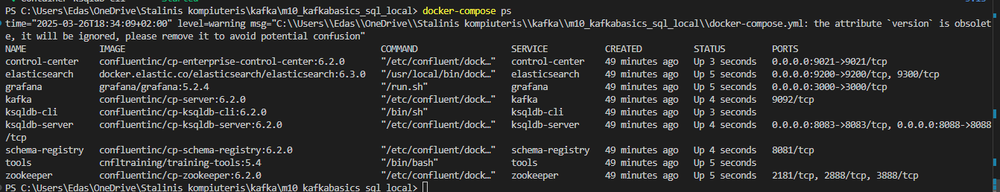

3. **Create Clickstream Tables and Connectors**
First I had to launch the cli
```bash
docker-compose exec ksqldb-cli ksql http://ksqldb-server:8088
```
after that, I checked if everything was okay 
```sql
show topics;
```

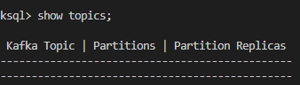

Then I ran the script which used ksql and created three source connector for generating data
```sql
RUN SCRIPT '/scripts/create-connectors.sql';
```

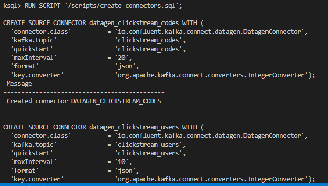

4. **Sampleing messages and checking UI**
```bash
print clickstream limit 3;
```

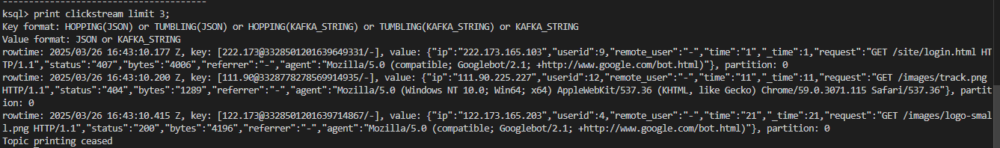

```bash
print clickstream_codes limit 3;
```

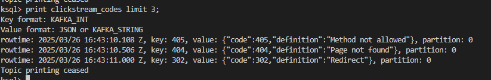

```bash
print clickstream_users limit 3;
```

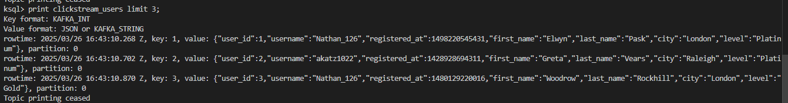

Then I checked UI, everything was working as expected

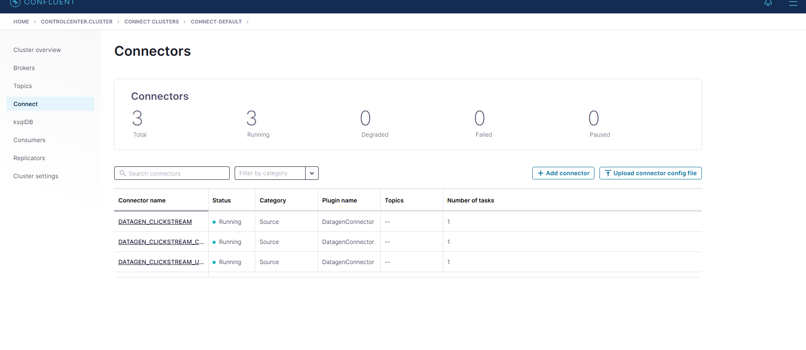

5. **Loading the streaming data to ksqldb**

Once again, I ran the script
```bash
RUN SCRIPT '/scripts/statements.sql';
```
Then verified the data

flow:

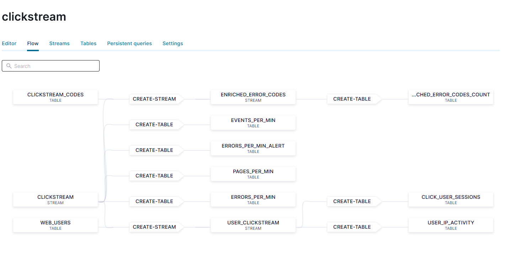

quering data:

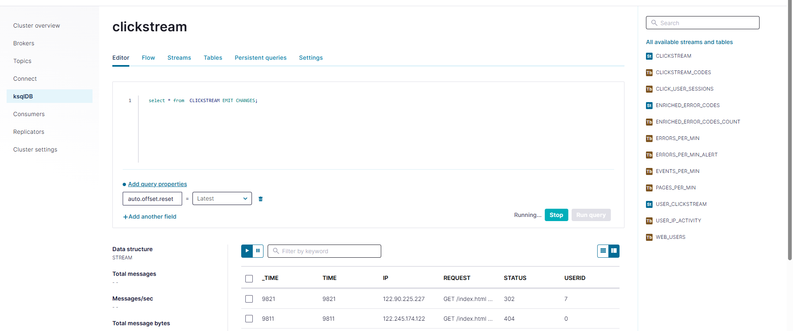

6. **Loading the clickstream data in grafana**

I had to run some initial scripts for elasticsearch document mapping template,
sending ksqlDB tables to elasticsearch and grafana and loading the grafana dashboard
```bash
docker-compose exec elasticsearch bash -c '/scripts/elastic-dynamic-template.sh'
docker-compose exec ksqldb-server bash -c '/scripts/ksql-tables-to-grafana.sh'
docker-compose exec grafana bash -c '/scripts/clickstream-analysis-dashboard.sh'
```
Then I navigated to grafana to check the dashboard

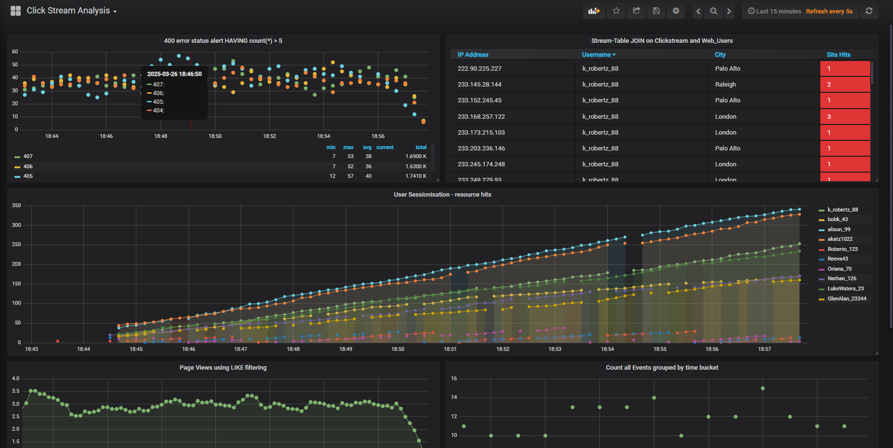

Also checked the confluent control center UI for the change in connectors, now besides the 3 original source connectors, there are also 7 sink connectors

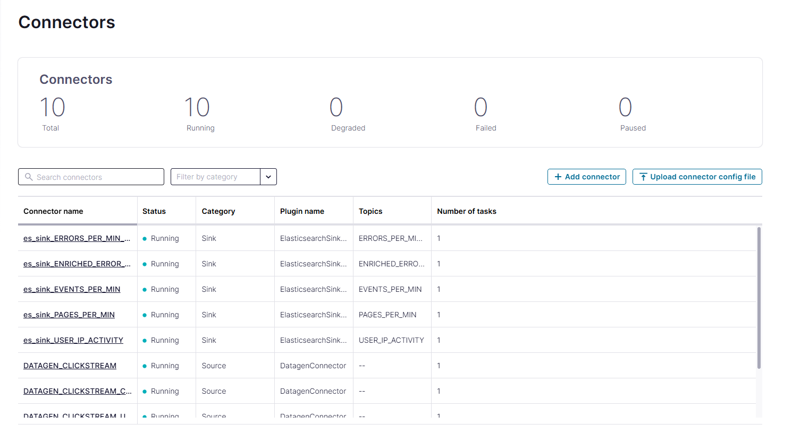

7. **Sessionizeing the data**

I executed one more script, for it to mock the data generation, it generates data for 90 secs and then for 35 secs it pauses the generation, and in our kafka the idelation period is 30 secs, so after it creates a new session for the data

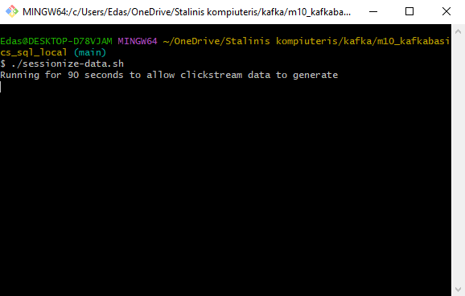

in grafana:

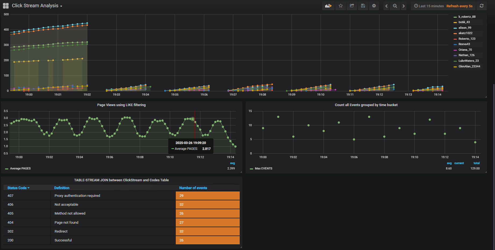

## Conclusion

I've completed the tutorial and now understand a bit better how kafka works, also gained experience working with confluent, grafana, elasticsearch.

## remark

I needed to change the spacing from crlf(windows style) to lf(unix style), and in docker-compose had to change from $pwd to just ./ for the scripts to run